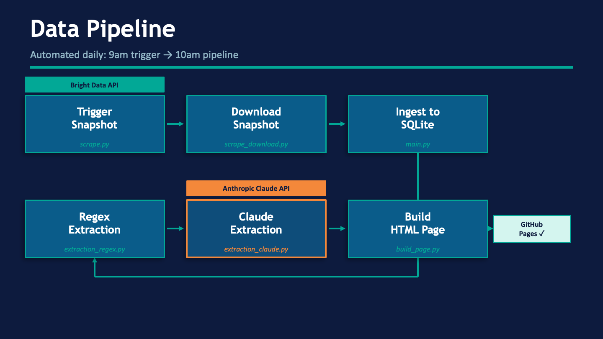
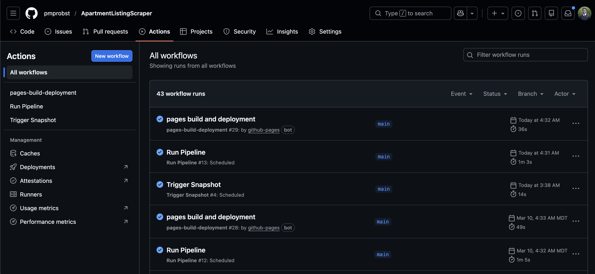
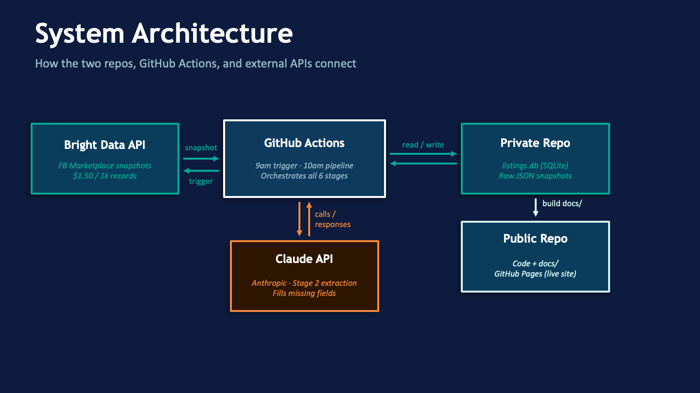
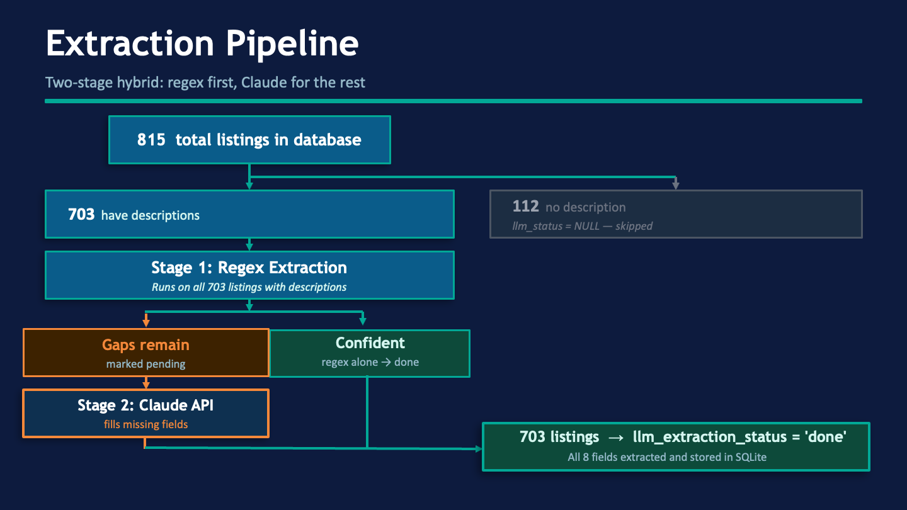
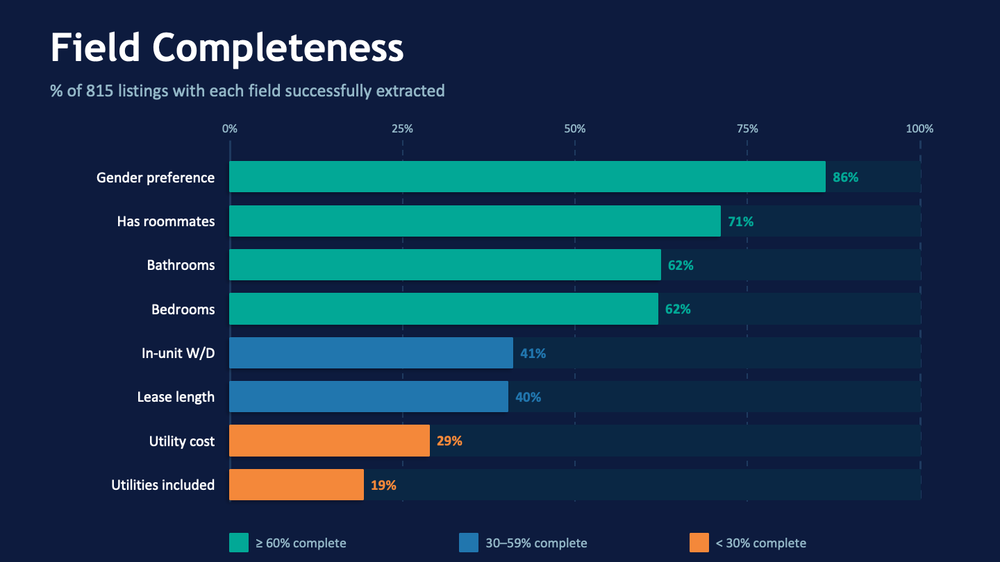
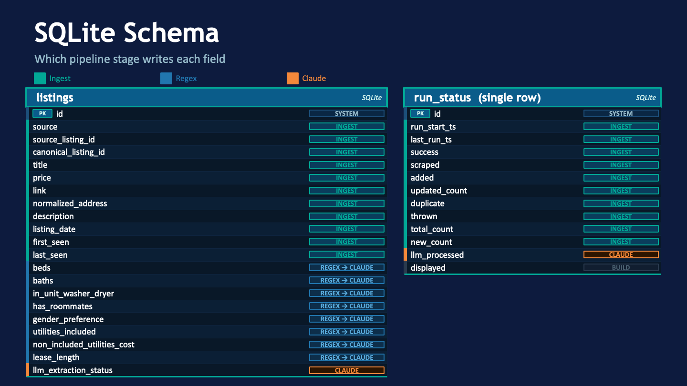

# I Built a Tool to Stop Drowning in Facebook Marketplace Apartment Listings

---

## Introduction

My housing contract ends in August. That means I've been doing what every college student in Provo eventually has to do: scrolling endlessly through Facebook Marketplace, clicking into listing after listing, trying to figure out if any of them are actually worth my time.

The problem isn't that the listings aren't there. There are plenty. The problem is that the details that actually matter, like whether utilities are included or what the lease term is, are buried in the descriptions. You have to click into every single post to find out. And half the time, the listing turns out to be female-only or is only available for the summer.

So I built a scraper that does the clicking for me, pulls out the structured data, filters out listings I'm not interested in, and presents everything in a clean table I can actually scan.

**[See the live table here](https://pmprobst.github.io/ApartmentListingScraper/)**

---

## The Motivating Question

What apartments are currently listed on Facebook Marketplace in the Provo/Orem area that fit my budget and needs — priced under $1,200/month, available for fall/winter, and not requiring roommates or restricted to female tenants?

---

## Can You Even Scrape Facebook?

Short answer: not directly. Facebook's Terms of Service explicitly prohibit unauthorized automated scraping, and their systems actively detect and block it via IP bans, CAPTCHAs, and account suspension.

The solution I used is **[Bright Data](https://brightdata.com)**, a commercial data provider that has its own compliant infrastructure for accessing Marketplace listings. Rather than scraping Facebook myself, I make an API call to Bright Data and they return a clean JSON snapshot of listings matching my search parameters. At $1.50 per 1,000 records, the cost for a personal project running daily is manageable.

I also built in good scraping practices beyond just legality: the pipeline runs once per day via GitHub Actions as to not hammer any API, and uses a single retry on timeouts rather than aggressive loops.

---

## How the Pipeline Works

The full pipeline runs automatically every day across six stages:

{width=95%}

1. **Trigger snapshot** (`scripts/scrape.py`) — sends a request to Bright Data's API to queue a fresh snapshot of Provo/Orem Marketplace listings
2. **Download snapshot** (`scripts/scrape_download.py`) — polls until the snapshot is ready, then downloads the raw JSON
3. **Ingest** — parses and normalizes each raw record, upserts it into a SQLite database, and tracks whether each listing is new, updated, or a duplicate
4. **Regex extraction** — runs pattern matching on listing descriptions to pull out structured fields
5. **Claude extraction** — for listings where regex left gaps, the Claude API fills in the missing fields
6. **Build page** — reads the filtered listings from SQLite and writes a static HTML table

The snapshot is triggered at 9am UTC; the rest of the pipeline runs at 10am UTC, giving Bright Data an hour to prepare the data.

{width=95%}

To keep sensitive data private, the pipeline uses two repos: the [public repo](https://github.com/pmprobst/ApartmentListingScraper) holds the code and the published HTML site, while a private repo holds the raw snapshot JSON and `listings.db`.

{width=95%}

---

## The Interesting Part: Extracting Structure from Messy Listing Text

Listing descriptions are written by humans. A typical description might say something like *"Men's private room. 3 roommates staying. Utilities usually about $80. Available April through August with option to renew."* From that, I need to reliably extract eight fields: bedrooms, bathrooms, in-unit washer/dryer, roommates, gender preference, utilities included, utility cost, and lease length.

I use a **two-stage hybrid approach**.

**Stage 1 — Regex** runs first on the combined title and description. The text is normalized first (emoji stripped, whitespace collapsed, common typos like `"utilites"` corrected), then it searches for pre-compiled patterns. Each field is marked as confident or not. If any field remains uncertain, the row is queued as `pending` for Stage 2.

**Stage 2 — Claude API** handles the listings regex couldn't confidently extract. The system prompt gives Claude context about the Provo/Orem student housing market, including that many listings are BYU/UVU contract sales where a current tenant is selling their spot. The regex pre-fills are passed as **ground truth** — Claude is told not to re-derive them, only to fill in the missing fields. Lease length is constrained to exactly three allowed strings (`"summer"`, `"summer w/ option to review"`, `"fall/winter"`), so Claude can't hallucinate an unusual format.

---

## Dataset Overview

As of March 11, the database currently holds **815 listings** accumulated over time. After filter out old listings, those above my $1,200 budget, and those that are female-only, roommate-required, and summer-only leases, **212 listings** are displayed in the current table.

The most recent pipeline run scraped 101 listings: 52 were new, 48 were updates to existing listings, 1 was thrown out, and 44 were processed by Claude.

**The nine columns displayed in the table:**

| Column | Description |
|---|---|
| Title | Listing title, linked to the original Facebook post |
| Price | Monthly rent (USD) |
| Beds | Number of bedrooms |
| Baths | Number of bathrooms |
| Listing date | Date originally posted |
| In-unit W/D | In-unit washer/dryer availability |
| Utilities | Which utilities are included in rent |
| Util cost | Estimated monthly cost of non-included utilities |
| Lease | Lease type (fall/winter, summer, etc.) |

**Extraction coverage varies quite a bit by field:**

- The low coverage on `utilities_included` (19%) isn't really an extraction failure. Most listings just don't mention utilities. Fields like gender preference and roommate status are well-covered because landlords in the BYU/UVU market tend to note them in the listings often.
- Prices cluster in the $480–$900/month range, with a median of $595. The distribution has a long right tail — a handful of listings go up to $2,850 — and at least one suspicious $10 listing suggesting data entry errors or scams.
- The market is overwhelmingly summer-focused. Of the 320 listings with an extracted lease length, 85% are summer or summer-with-renewal. Fall/winter leases make up only 8%, which is why so few listings pass the filter for the displayed table.
- Most listings involve roommates (83% of those with the field extracted). Only 96 listings advertise a private/no-roommate situation.
- Gender restrictions are common: 20% of listings are female-only and 11% are male-only, meaning a fifth of all listings are off the table for me before price or availability are even considered.
- In-unit washer/dryer coverage is split nearly 50/50 among listings that mention it (181 yes vs. 153 no), but the field is only populated for ~41% of listings — so the true share is unknown for the majority.

**Notable data quality considerations:**
- Listings without descriptions (14% of the dataset) can't be extraction-processed and will show mostly null fields
- The 30-day rolling window means the table reflects current availability
- Only Facebook Marketplace is covered; KSL, Zillow, and other platforms are not included

{width=95%}

---

## Conclusion

Want to build something similar? The full code is on GitHub: **[github.com/pmprobst/ApartmentListingScraper](https://github.com/pmprobst/ApartmentListingScraper)**

To replicate this for another city or platform, you'd need:
- A **[Bright Data](https://brightdata.com)** account (pricing: $1.50/1k records)
- An **[Anthropic API key](https://www.anthropic.com)** for the Claude extraction step
- GitHub Actions secrets for both keys and a private repo for your database
- Updates to `config.toml` to point at your target city, price range, and category

Additional resources: [SQLite documentation](https://www.sqlite.org/docs.html) · [GitHub Actions documentation](https://docs.github.com/en/actions)